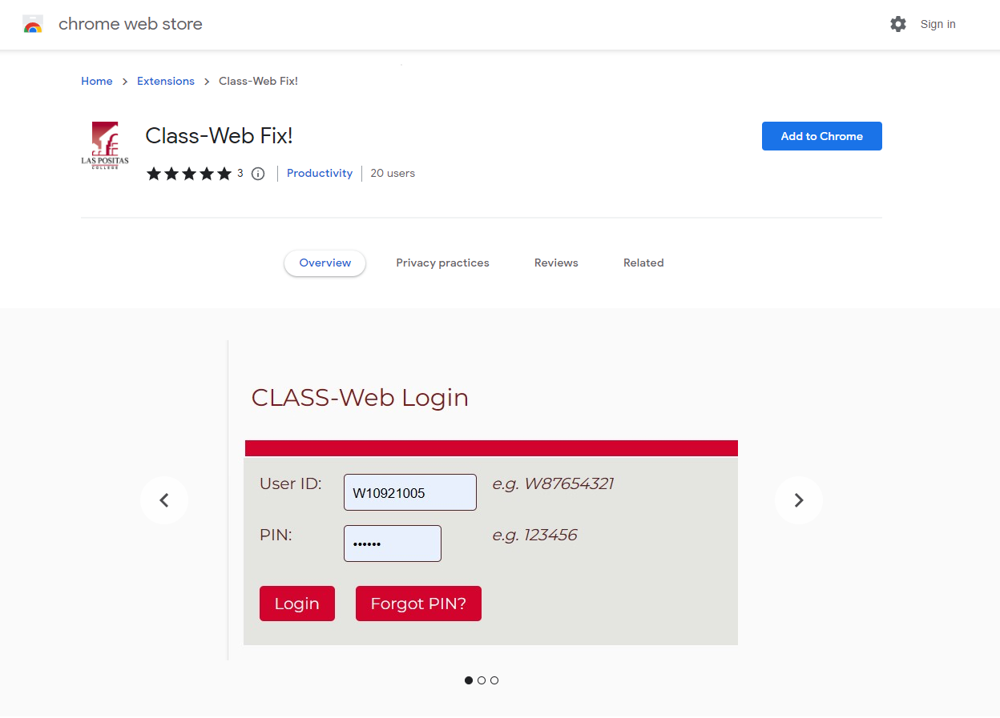
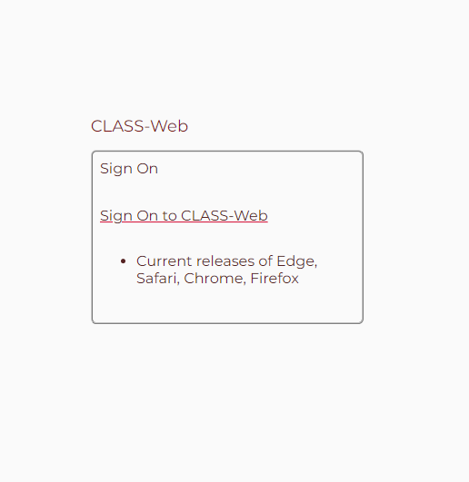
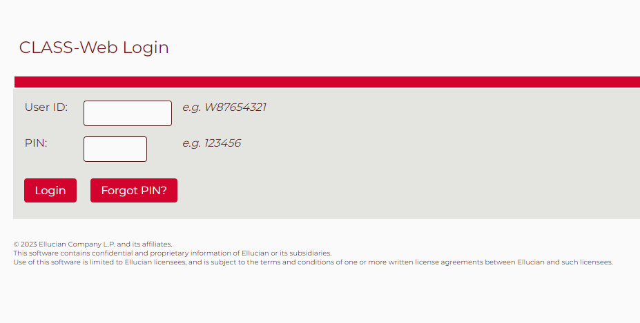
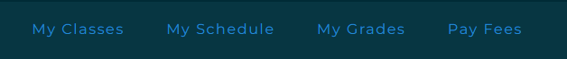
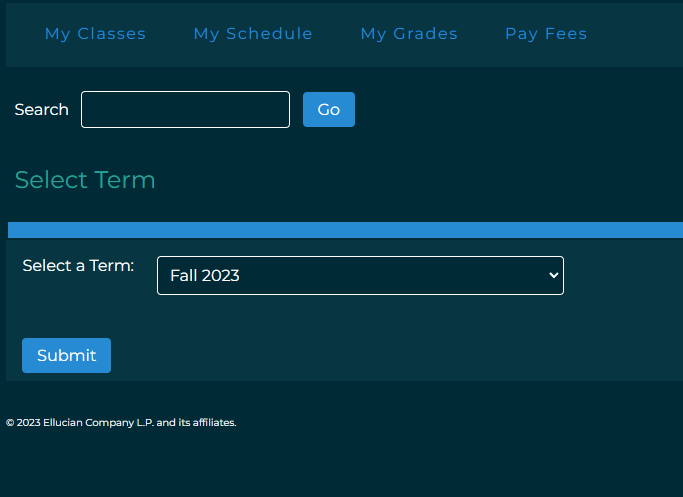
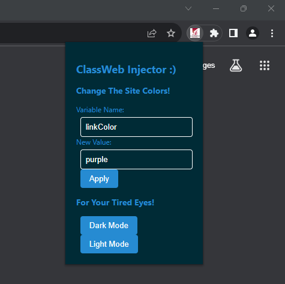
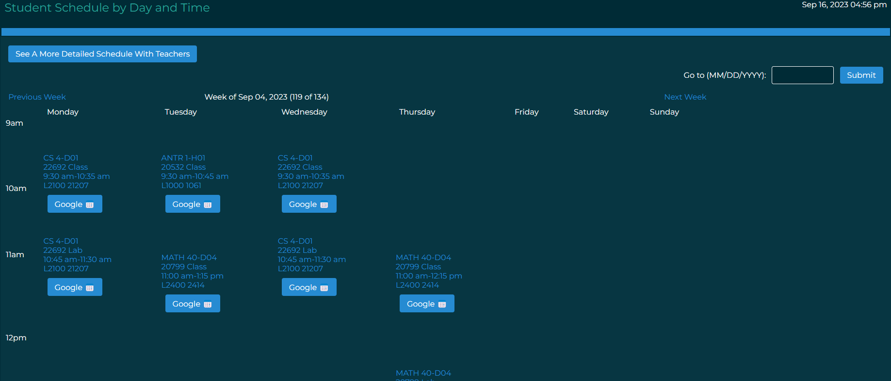
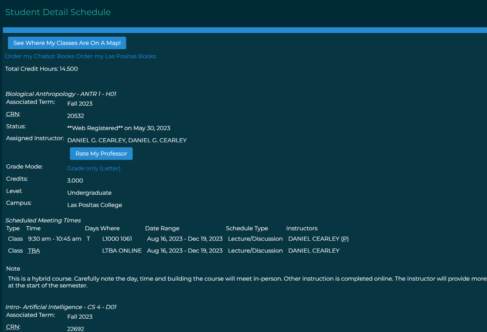
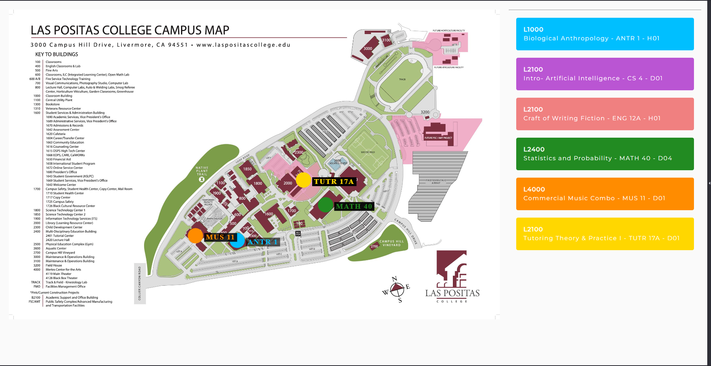

# Class-Web Fix
This extension overhauls the look and feel of Class Web for Las Positas and Chabot Students.
It adds new features to make signing up for classes and finding those classes on campus easier than ever.
## Supported Browsers
* Google Chrome 
* Brave
* Opera & Opera GX
* Vivaldi
* Other Chromium Browsers
* Firefox (Not fully supported yet) needs a separate extension to work, click this link [here](https://github.com/LuciPengu/Classweb-JS-Fix/tree/main) 
## Installation
1. Click this link [here](https://chrome.google.com/webstore/detail/class-web-fix/fchgpbfllmijdknkddmhhelbkhelpcng) to take you to the extension store
2. Click on the **Add to Chrome** or **Get** button and the extension will be installed

## Login
1. The login page will look different than before

2. Click **Sign On to CLASS-Web**, and it will take you to this page

3. Enter your W# and pin as you normally would
## Features
### Fast Menu
* There are new options at the top of class web once you log in

### Adding Classes
* Clicking on the **My Classes** button in the fast menu takes you here

* You can add or drop classes like normal
### Dark Mode
* Find the extension icon in your browser and click on it to reveal this menu.
* Click on the dark mode button, and Class-Web will be in dark mode!

### Easy Schedule
* Clicking on the **My Schedule** button in the fast menu takes you to this page

* All classes for the week will be displayed in a calendar like format
* **Previous Week** and **Next Week** buttons changes the week you will see on screen
* Clicking on the **Google** button adds the event to Google calendar

* Clicking on the **See A More Detailed Schedule With Teachers** shows this page.

* All the relevant information about each class you're taking in the term available
* Your total credit hours visible
* Buttons to order books for Chabot or Las Positas college
* **See Where My Classes Are On A Map** button shows where all your classes will take place

